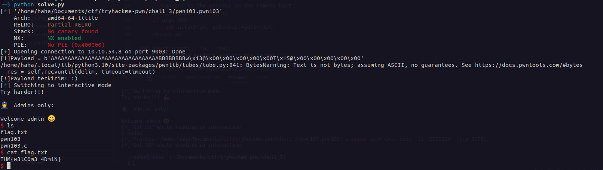

# pwn103

Pada soal ini kita melakukan ret2win. Terdapat celah pada pilihan ke 3, dimana kita bisa melakukan buffer overflow dan mereplace retturn address ke fungsi admins_only dan kita akan mendapat shell dari soal ini.

Tetapi kita mendapatkan masalah pada saat kita membuat payload kita tidak bisa mengakses shell dari soal ini. Ternyata hal ini disebabkan oleh MOVAPP yang menyebabkan segfault. Maka dari itu kita harus menambahkan return address lain agar kita bisa baypass masalah ini.

[Solver bisa dilihat di sini.](./solve.py)

### Flag
THM{w3lC0m3_4Dm1N}