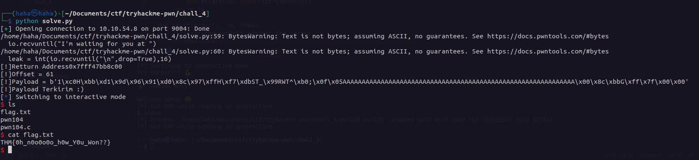

# pwn 104

Soal ini kita gunakan metode shellcode untuk mendapatkan flag. Kita dengan mudah mendapat address buffer kita. Kita susun payload yang berisi shellcode yang akan di eksekusi ditambah return address buffer kita.

[Solver bisa dilihat di sini.](./solve.py)

### Flag
THM{0h_n0o0o0o_h0w_Y0u_Won??}