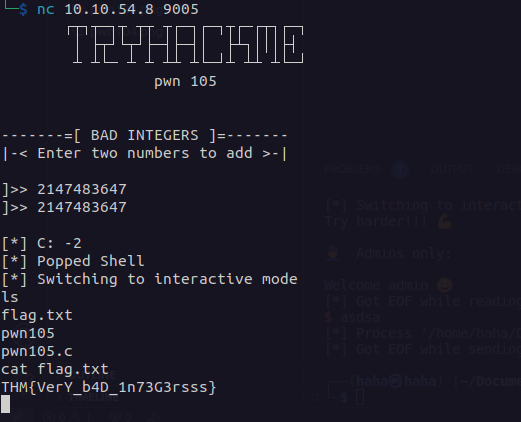

# pwn 105

Soal ini memerlukan kita untuk mendapat nilai mines tetapi kita tidak bisa menginputkan nilai mines secara langsung. Kita bisa memanfaatkan max integer ada bahasa C yaitu `2147483647`. Jika kita memasukan nilai ini maka hasil yang kita dapat adalah -2

[Solver bisa dilihat di sini.](./solve.py)

### Flag
THM{VerY_b4D_1n73G3rsss}